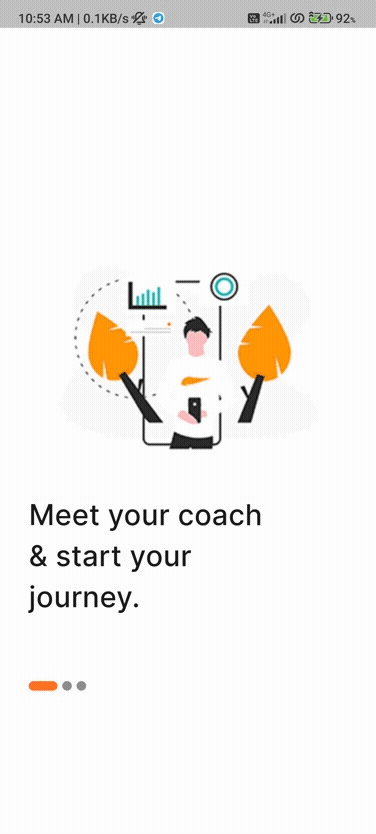
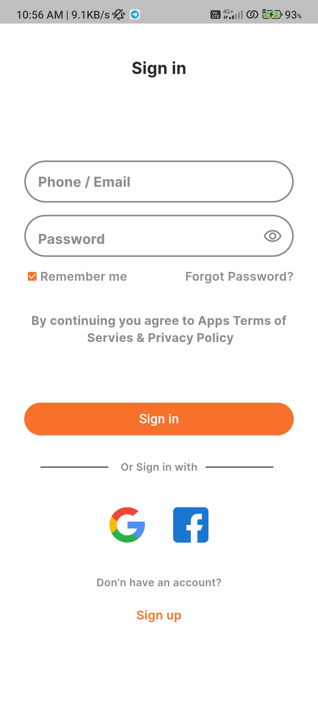
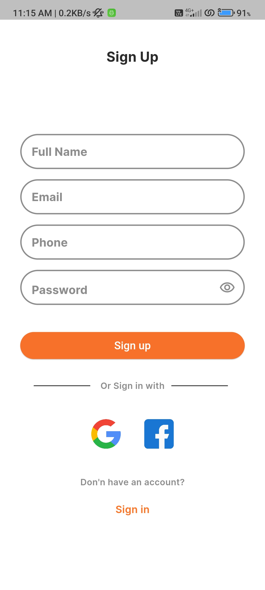
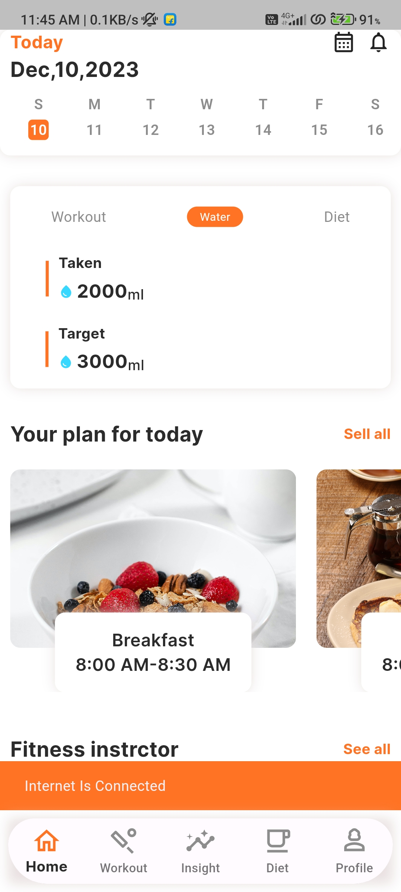
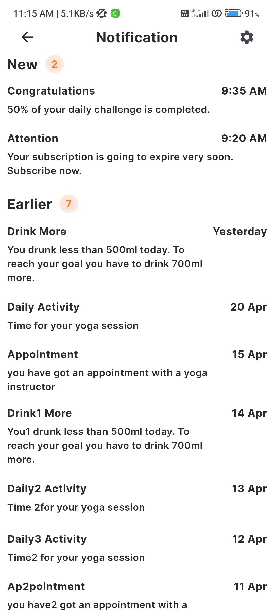
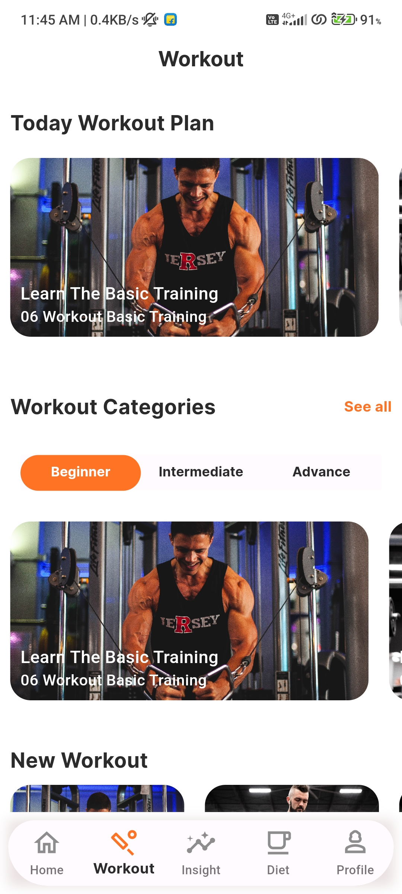
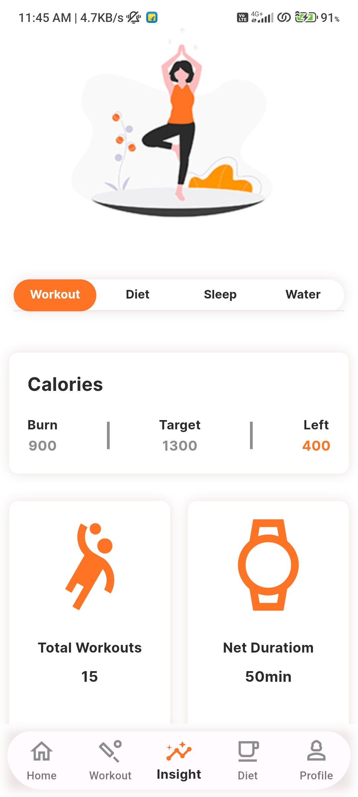
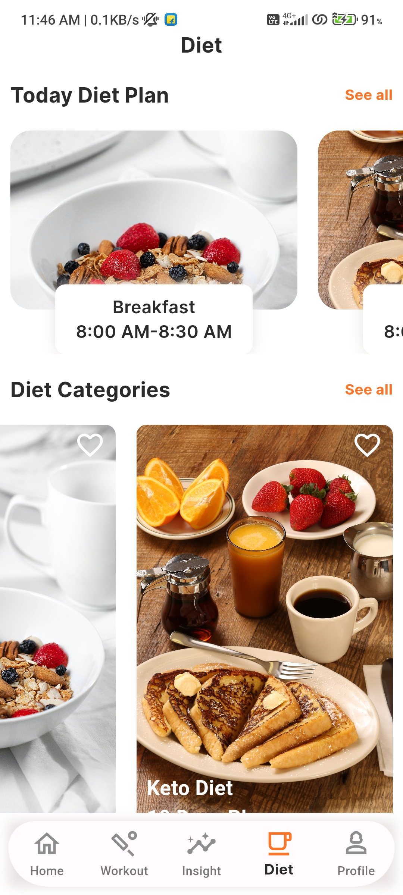

# Diet App
A Flutter-based mobile application for managing diet plans, workouts, and maintaining a healthy lifestyle.

## Description
- **Workout Categories:** Explore beginner, intermediate, and advanced workout categories.
- **Custom Workout Plans:** Tailor your workout plans based on your fitness goals.
- **Diet Tracking:** Log and monitor your daily nutritional intake.
- **Progress Tracking:** Track your fitness progress with charts and statistics.
- **Healthy Recipes:** Discover and try out healthy recipes for a balanced diet.

## Gif

 
 
 

## App Screen ScreenShots

